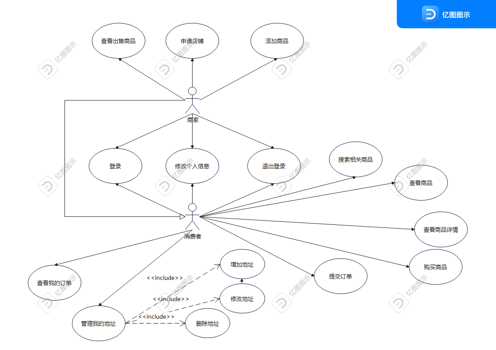
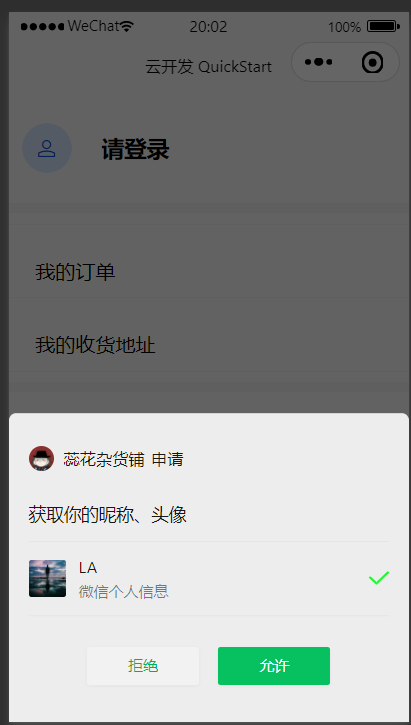
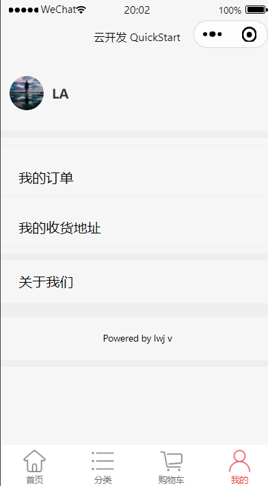
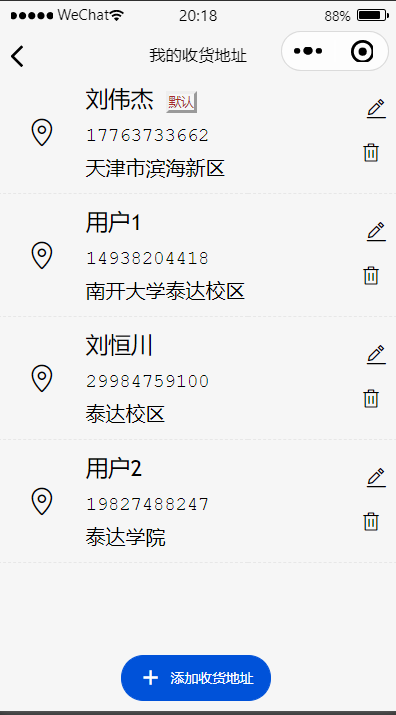
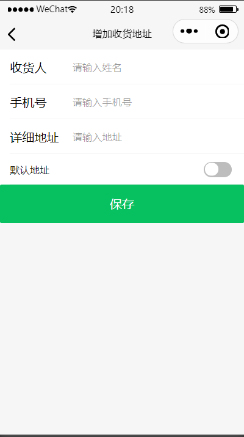
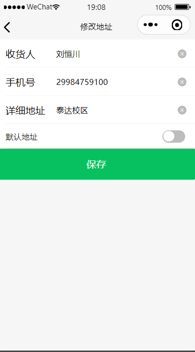
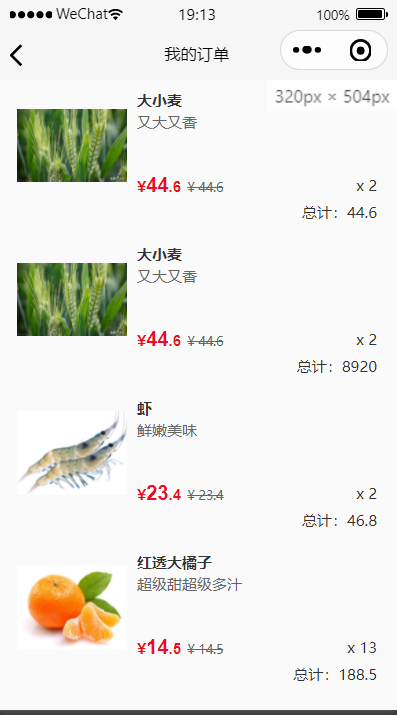
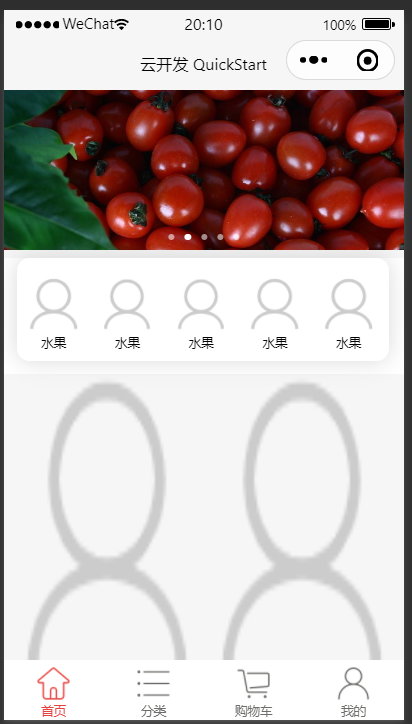
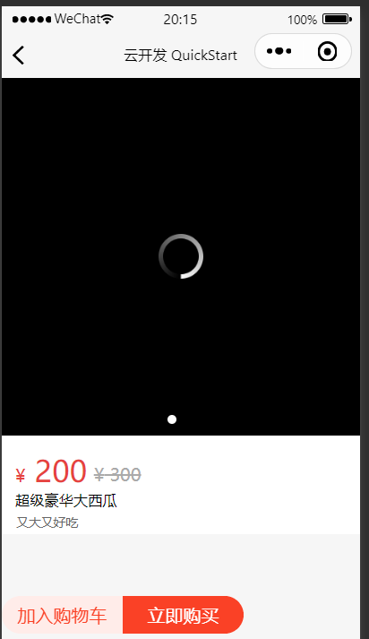

### 农家产品销售系统小程序介绍文档（最终版本）

##### 作品介绍

------

1. 内容介绍

   本产品旨在为农村特色产品的销售提供平台。支持产品上线，交流等

2. 应用场景

   该产品实现在农村中，为游客们提供购买服务

3. 版本号

   1.0.0

#### 需求功能分析

------

- 用例图

  - 

- 用例说明

  - - | 用例编号   | 001                                                          |
      | :--------- | :----------------------------------------------------------- |
      | 用例名称   | 登录                                                         |
      | 参与者     | 消费者和商家                                                 |
      | 用例说明   | 消费者通过登录注册或者获得个人信息                           |
      | 前置条件   | 无                                                           |
      | 基本事件流 | 1. 点击登录按钮 2.申请获得微信信息 3.系统存储信息或者对于已有用户从系统中获取数据 4.用户登录成功 |
      | 异常事件流 | 无                                                           |
      | 后置条件   | 无                                                           |
      
    - | 用例编号   | 002                                     |
      | :--------- | :-------------------------------------- |
      | 用例名称   | 退出登录                                |
      | 参与者     | 消费者和商家                            |
      | 用例说明   | 用户通过点击退出登录按钮退出登录        |
      | 前置条件   | 以完成登录                              |
      | 基本事件流 | 1. 点击退出登录按钮 2.退出登录成功 |
      | 异常事件流 | 无                                      |
      | 后置条件   | 将清除缓存信息                          |
    
    - | 用例编号   | 003                                                          |
      | :--------- | :----------------------------------------------------------- |
      | 用例名称   | 修改个人信息                                                 |
      | 参与者     | 消费者和商家                                                 |
      | 用例说明   | 用户修改个人信息                                             |
      | 前置条件   | 完成登录                                                     |
      | 基本事件流 | 1. 点击需要修改的信息 2.点击昵称修改进入昵称修改页面 3.修改昵称并保存 4.修改图片并保存 5.修改成功 |
      | 异常事件流 | 1.上传不是图像的格式，修改失败                               |
      | 后置条件   | 将修改的个人信息保存到数据库                                 |
    
    - | 用例编号   | 004                                                          |
      | :--------- | :----------------------------------------------------------- |
      | 用例名称   | 查看我的订单                                                 |
      | 参与者     | 消费者                                                       |
      | 用例说明   | 消费者查看我的订单                                           |
      | 前置条件   | 完成登录                                                     |
      | 基本事件流 | 1. 点击我的订单 2.从数据库中获得订单数据 3.查看订单 |
      | 异常事件流 | 无                                                           |
      | 后置条件   | 无                                                           |
    
    - | 用例编号   | 005                                                          |
      | :--------- | :----------------------------------------------------------- |
      | 用例名称   | 管理我的地址                                                 |
      | 参与者     | 消费者                                                       |
      | 用例说明   | 消费者管理我的地址                                           |
      | 前置条件   | 完成登录                                                     |
      | 基本事件流 | 1. 点击我的收获地址 2.进入我的地址管理页面 3.从数据库中获得地址 4.显示地址-如没有则显示无地址 |
      | 异常事件流 | 无                                                           |
      | 后置条件   | 无                                                           |
    
    - | 用例编号   | 006                                                          |
      | :--------- | :----------------------------------------------------------- |
      | 用例名称   | 增加地址                                                     |
      | 参与者     | 消费者                                                       |
      | 用例说明   | 消费者增加地址                                               |
      | 前置条件   | 完成登录                                                     |
      | 基本事件流 | 1. 用户输入收货人姓名 2.用户输入手机号 3.用户输入详细地址 4.用户设置是否为默认地址 5.点击保存按钮 6.完成保存 |
      | 异常事件流 | 1.手机号不符合格式，无法保存                                 |
      | 后置条件   | 地址信息保存到地址信息数据库中,系统返回到收货地址页面        |
    
    - | 用例编号   | 007                                                          |
      | :--------- | :----------------------------------------------------------- |
      | 用例名称   | 修改地址                                                     |
      | 参与者     | 消费者                                                       |
      | 用例说明   | 消费者修改个人地址                                           |
      | 前置条件   | 完成登录且存在地址                                           |
      | 基本事件流 | 1. 点击修改icon 2.进入修改页面 3.修改收货人，手机号和详细地址的信息，并设置是否为默认地址 4.点击保存按钮 5.完成修改 |
      | 异常事件流 | 1.手机号修改不符合规定，无法保存                             |
      | 后置条件   | 将数据库中的地址信息进行修改                                 |
    
    - | 用例编号   | 008                             |
      | :--------- | :------------------------------ |
      | 用例名称   | 删除地址                        |
      | 参与者     | 消费者                          |
      | 用例说明   | 消费者删除地址                  |
      | 前置条件   | 完成登录且存在地址              |
      | 基本事件流 | 1. 点击删除icon 2.删除地址 |
      | 异常事件流 | 无                              |
      | 后置条件   | 将数据库中的地址删除            |
    
    - | 用例编号   | 009                                                          |
      | :--------- | :----------------------------------------------------------- |
      | 用例名称   | 申请店铺                                                     |
      | 参与者     | 商家                                                         |
      | 用例说明   | 商家申请店铺                                                 |
      | 前置条件   | 完成登录                                                     |
      | 基本事件流 | 1. 商家输入姓名，电话号码，身份证号，店铺名称，店铺地址，出售方向 2.点击申请按钮 3.将店铺信息保存到数据库中 4.并修改个人信息为成为商家 |
      | 异常事件流 | 1.电话号码不符合规定，无法申请 2.身份证号不符合规定，无法申请 3.存在信息为空，无法申请 |
      | 后置条件   | 返回个人信息的主页面                                         |
    
    - | 用例编号   | 0010                                                      |
      | :--------- | :-------------------------------------------------------- |
      | 用例名称   | 查看我的商品                                              |
      | 参与者     | 商家                                                      |
      | 用例说明   | 商家查看我的商品                                          |
      | 前置条件   | 完成登录且完成申请店铺的注册                              |
      | 基本事件流 | 1. 进入页面 2.从数据库中获取商品信息 3.展示出来 |
      | 异常事件流 | 无                                                        |
      | 后置条件   | 无                                                        |
    
    - | 用例编号   | 0011                                                         |
      | :--------- | :----------------------------------------------------------- |
      | 用例名称   | 添加商品                                                     |
      | 参与者     | 商家                                                         |
      | 用例说明   | 商家添加商品                                                 |
      | 前置条件   | 完成登录且已完成申请店铺                                     |
      | 基本事件流 | 1. 进入页面会展示发表须知 2.点击确认按钮可添加商品 3.输入商品名称，原价 4.选择是否存在折扣，如有折扣则输入折扣 5.输出手机号，标签，描述 6.选择类别 7.点击产品图片和详细图片上传按钮，获取本地图片 8.上传图片展示在页面中 9.点击发布按钮 10.数据库保存数据 11.完成发布 |
      | 异常事件流 | 1.价格不符合规定，无法发布 2.存在空白数据 3.上传的图片格式不正确 4.上传的图片过多，无法保存 |
      | 后置条件   | 无                                                           |
    
    - | 用例编号   | 0012               |
      | :--------- | :----------------- |
      | 用例名称   | 查看商品           |
      | 参与者     | 消费者和商家       |
      | 用例说明   | 用户查看商品       |
      | 前置条件   | 无                 |
      | 基本事件流 | 1.主页直接查看商品 |
      | 异常事件流 | 无                 |
      | 后置条件   | 无                 |
    
    - | 用例编号   | 0013                     |
      | :--------- | :----------------------- |
      | 用例名称   | 查看商品详情             |
      | 参与者     | 消费者和商家             |
      | 用例说明   | 消费者和赏金查看商品详细 |
      | 前置条件   | 无                       |
      | 基本事件流 | 1.点击商品进入商品详界面 |
      | 异常事件流 | 无                       |
      | 后置条件   | 无                       |
    
    - | 用例编号   | 0014                                                     |
      | :--------- | :------------------------------------------------------- |
      | 用例名称   | 搜索相关商品                                             |
      | 参与者     | 消费者                                                   |
      | 用例说明   | 消费者搜索相关商品                                       |
      | 前置条件   | 无                                                       |
      | 基本事件流 | 1.输入想搜索的信息 2.点击搜索 3.进入搜索的页面 |
      | 异常事件流 | 无                                                       |
      | 后置条件   | 无                                                       |
    
    - | 用例编号   | 0015                                                         |
      | :--------- | :----------------------------------------------------------- |
      | 用例名称   | 购买商品                                                     |
      | 参与者     | 消费者                                                       |
      | 用例说明   | 消费者购买商品                                               |
      | 前置条件   | 存在商品且已登录                                             |
      | 基本事件流 | 1.点击详情页面的立即购买按钮 2.确定地址和数量 3.点击购买 4.进入提交订单页面 |
      | 异常事件流 | 无                                                           |
      | 后置条件   | 无                                                           |
    
    - | 用例编号   | 0016                                                         |
      | :--------- | :----------------------------------------------------------- |
      | 用例名称   | 提交订单                                                     |
      | 参与者     | 消费者                                                       |
      | 用例说明   | 消费者提交订单                                               |
      | 前置条件   | 完成购买商品的用例                                           |
      | 基本事件流 | 1.确定商品详细内容 2.提交订单 3.数据库存储订单 4.完成订单 |
      | 异常事件流 | 无                                                           |
      | 后置条件   | 无                                                           |
    
    

##### 产品功能介绍

------

- 个人信息
  - 实现登录退出的功能（迭代一）
    - 点击登录即可登录，并录入信息（OpenID)
      - 使用wx.getUserProfile函数获得微信信息，并保存信息到数据库中或从数据库中提取数据
      - 
    - 
    
  - 修改信息的功能
    - 修改姓名等信息，在下次登录时即可显示
      - 
    
  - 个人信息界面的UI初步设计
    - 个人信息依次排列
    
  - 地址的设置（迭代三）
  
    - 展示地址并选定默认地址
      - 会优先展示默认地址，先从数据库中查询默认地址，然后在查询其他地址
      - 
    - 可以添加地址
      - 若设定为默认地址，则先从数据库中将已有默认地址取消。
      - 并且还会检查输入信息是否为空
      - 
  
    - 修改地址和删除地址（点击上上图图标和图标)
      - 
    
  - 查看我的订单
  
    - 
  
- 我的店铺
  
  - 申请店铺--填写个人信息之后申请店铺
    - 
  
  - 申请完成之后--查看商家出售的商品
    - 
  
  - 添加商品
    - 中间存在是否添加折扣的选项，并且会有选择填入标签促进商品的搜索，并将商品在此分类
    - 通过VantUI的组件上传照片----获得本地照片的地址，并通过地址展现出来，然后使用wx.cloud.uploadFile函数上传图片到云存储，获取其fileID,将其存储到数据库中
    - 可以添加多个图片
    - 
  
- 主页面（迭代二）（迭代三---UI界面的进一步优化）
  - 主页面界面UI的初步构建
    - 以头部的轮播图展示新产品或者火热产品，接下里显示产品分类，不同产品不同分类。下层就是产品的展示，可以向下无限增加产品的展示。
    - 轮播图会展示其相对热度较高的产品，通过比较产品的点击次数，选择最高点击的五个产品进行展示
    - 产品分类--8中产品的分类--点击不同的分类进入不同的产品类别界面
    - 产品的展示---会首先从数据中获取10个产品，在每次滑到底部时，会触发onReachBottom函数，再从数据库中获取6个产品数据，若没有多余产品会显示“没有更多了”
      - 
    - 迭代二的页面
    - 最终版本的页面
  - 产品页面的UI构建（迭代二）
    - 首先有图片或者视频展示产品的优势，然后下方提供价格和介绍。
    - 迭代二
    - 最终版本
    - ​              
  - 产品的购买
    - 获取购买产品的信息和数量
    - 通过点击购买进入订单页面，并通过url将购买信息传入到订单页面
    - 
    - 订单页面--确认订单之后提交订单
    - 将订单传入数据库中
    - 

- 搜索框

  - 通过搜索商品的名称，标签，详细介绍等是否存在搜索中的内容来展示搜索后的结果
  - 
  - 

- 分类框

  - 产品分类
  - 点击不同产品分类进入获得不同产品分类的产品
  - 

##### 数据库的建设

------

- address
  - 消费者地址数据库
  - 数据结构
    - _id:自带id
    - _openid:微信用户的专有id
    - address:地址
    - default:是否为默认地址
    - name:姓名
    - phoneNameber:电话号码
  - 
- goods
  - 商品信息数据库
  - 数据结构
    - _id:自带id
    - _openid:微信用户专有id
    - good_name:商品名称
    - good_decriber:商品描述
    - good_label:商品标签
    - good_or_price:商品原价
    - good_de_price:商品折扣价格
    - good_species:商品的类别
    - good_picture:数组的形式----商品的展示照片
    - good_de_picture:数组的形式---商品的详细展示照片
  - 
- login
  - 登录信息数据库
  - 数据结构
    - _id:自带id
    - _openid:微信用户专用id
    - name:微信名字
    - store:是否有自己的店铺
  - 
- order
  - 订单信息数据库
  - 数据结构
    - _id:自带id
    - _openid:微信用户专有id
    - good_name:商品名称
    - good_decriber:商品描述
    - good_or_price:商品原价
    - good_de_price:商品折扣价格
    - good_species:商品的类别
    - good_picture:数组的形式----商品的展示照片
    - good_id:商品的唯一id
    - address_id:地址的唯一id
    - number:购买数量
    - price:总价
  - 
- store
  - 店铺信息数据库
  - 数据结构
    - _id:自带id
    - _openid:微信用户专有id
    - address:店铺地址
    - c_number:个人信息身份证
    - name:姓名
    - phone:电话号
    - store_name:店铺名称
    - detail:售卖商品的方向

##### 技术介绍

------

- 前端
  - 总览
    - 以微信的原生组件为基础，加入Tdesign和Vant UI进行设计，试用CSS渲染
    - 试用微信的API进行个人信息的获取和本地缓存的存储
  - 函数介绍
    - getUserProfile函数进行微信数据的提取
    - 使用云函数获得OpenID
    - setStorageSync和getStorageSync进行本地缓存的存储和获取
    - 利用基础函数进行小程序的UI设计
    - wx.cloud.uploadFile函数上传图片
  - 设计思路
    - 个人信息
      - 利用API获取个人数据后，插入数据库中，形成一个个体，此用户的所以信息都与子匹配（查看，修改，增加和删除）
- 后端
  - 总览
    - 利用云函数和云开发进行数据库的增删改查
    - 利用云函数和云开发进行数据(照片和视频等）存储

##### 迭代过程功能介绍

------

- 迭代一
  - 实现了登录退出功能
  - 实现了个人信息的修改
- 迭代二
  - 完善个人信息的UI界面
  - 初步实现主页面的UI
  - 初步实现产品页面的UI
- 迭代三
  - 实现地址管理的功能
    - 查看
    - 修改
    - 增加
    - 删除
  - 我的订单查看
- 迭代四
  - 我的店铺
    - 我的商品的查看
    - 添加商品功能
      - 上传基本信息和图片
  - 主题页面的UI
  - 查看单个商品的详情
  - 购买功能
  - 下订单的功能
  - 搜索的功能